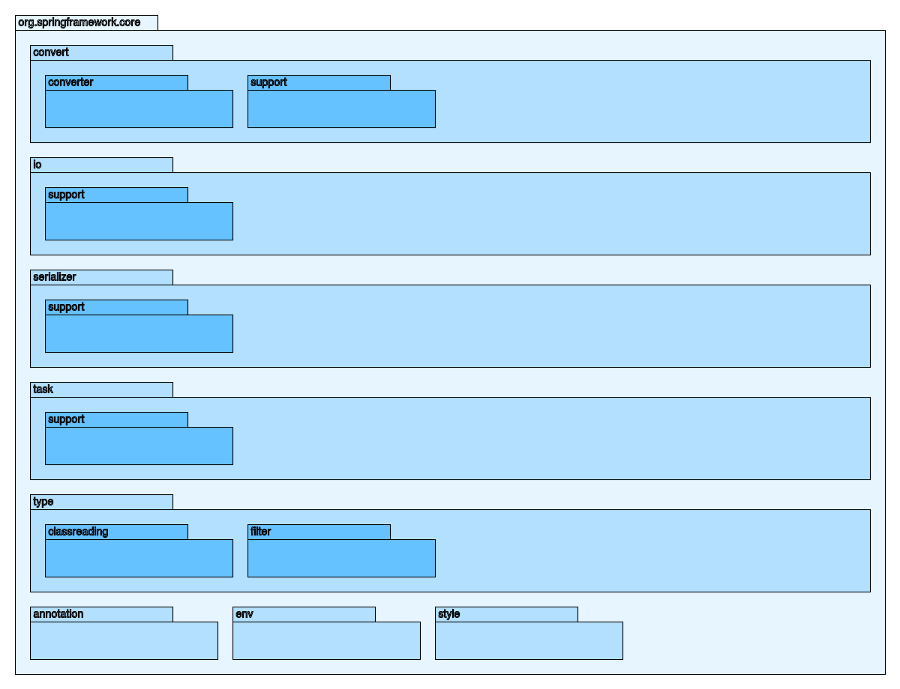
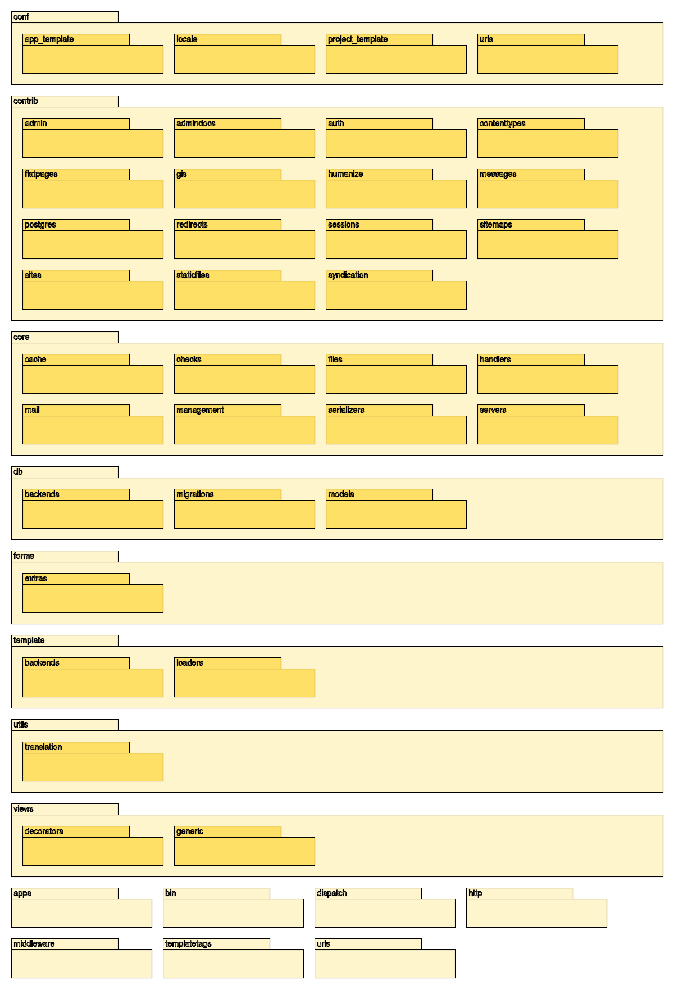

# drawpack

## Features

 * Generates SVG package diagrams from directory structure 
 * Independent of the programming language
 * Supports Java packages
 * 3 predefined color schemes
 * Combined with [ImageMagick](http://www.imagemagick.org) , generates PNG diagrams

## Usage examples

 * Standalone
   - python draw.py path max_indent base_color [main package prefix]
   -  python draw.py test 3 blue > diagram.svg
 * With ImageMagick
   - ./draw.sh test my_project 3 blue
 * With Java base package name
   - ./draw.sh  ~/spring-framework-master/spring-core/src/main/java/org/springframework/core/ core 3 blue org.springframework.core
 * For any other language
   - ./draw.sh ~/django-master/django/ django 2 yellow

## Examples

 * Spring core package diagram 
 * Django package diagram 
